# AYUDA 

## Instalación de R
Se asume que el usuario tiene instaldo R con las librerías: `ggplot2`, `knitr`, `plyr` y `xtable`.

Para más información sobre la instalación de R y librerías añadidas consultar la página:

http://cran.r-project.org/doc/manuals/r-release/R-admin.html

## Cargar scripts
Para iniciar la exploración hay que cargar el script `interfaz.R` con el siguiente comando:

`source("interfaz.R")`

## Uso básico

## Exploración

### Ejemplos básicos de generación de gráficos

| Comando                                                                     |  Gráfico                                                            |
|:----------------------------------------------------------------------------|:-------------------------------------------------------------------:|
|                                                                             |                                                                     |
| `MostrarAprobadosPorCursoEnAsignatura("Guitarra")`                          | 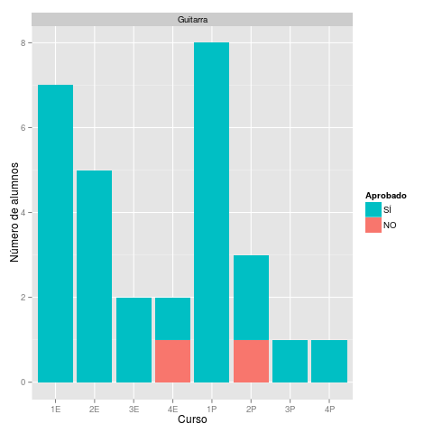             |
| `MostrarAprobadosPorCursoEnDepartamento("Cuerda_Pulsada")`                  | 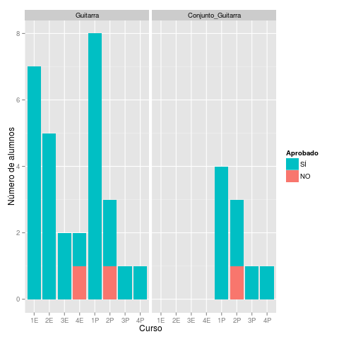        |
| `MostrarAprobadosPorCursoEnDepartamento("Cuerda_Pulsada", desglosar=FALSE)` | 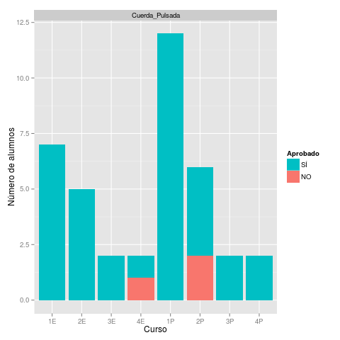                   |
| `CompararNotasPorCursoEnAsignatura("Guitarra")`                             | 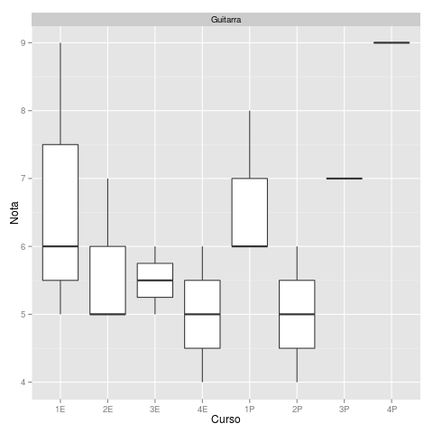        |
| `CompararNotasPorCursoEnDepartamento("Cuerda_Pulsada")`                     | 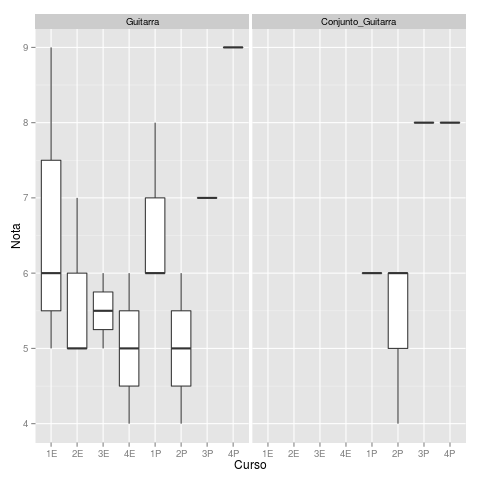   |
| `CompararNotasPorCursoEnDepartamento("Cuerda_Pulsada", desglosar=FALSE)`    | 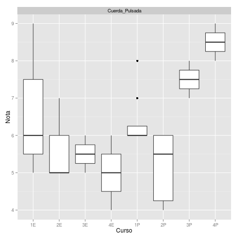              |
| `ContarNotasEnAsignatura("Guitarra")`                                       | 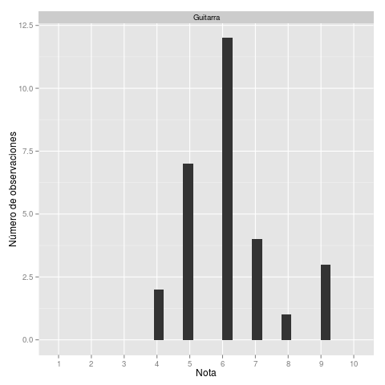          |
| `ContarNotasEnDepartamento("Cuerda_Pulsada")`                               | 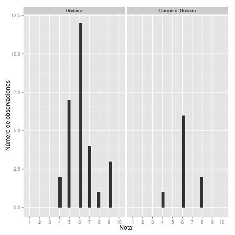     |
| `ContarNotasEnDepartamento("Cuerda_Pulsada", desglosar=FALSE)`              | 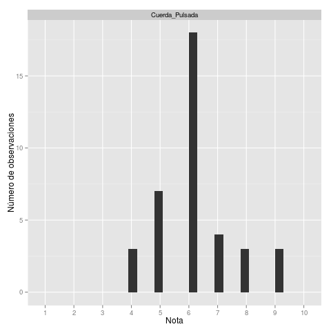                |
| `CompararDistribucionesDeNotasPorCurso()`                                   | 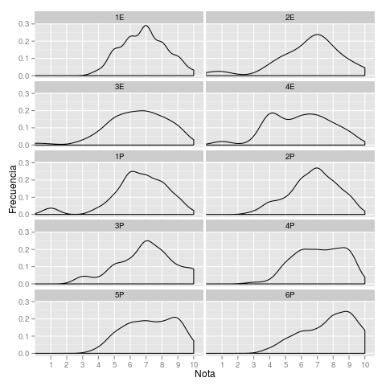           |
| `CompararAprobadosPorCurso()`                                               | 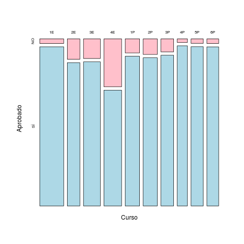               |

## Impresión de informe

`GenerarInforme()`
